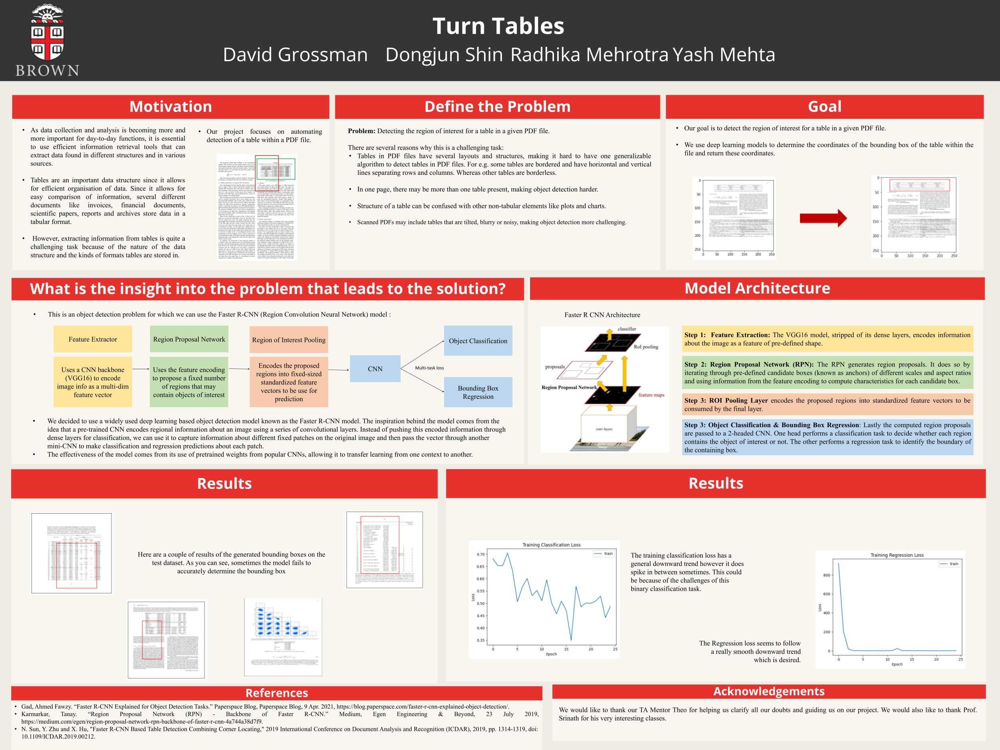

# Faster R-CNN for Table detection

## Group members

Radhika Mehrotra

David Grossman

Dongjun Shin

Yash Mehta

## Overview

Table detection in documents plays an important role in information retrieval and extraction of tabular data embedded in PDF files. Although there has been development in this area recently, it is still a considerably challenging problem given the nature of the object we are trying to detect and extract information from. A significant problem is one of inaccurately locating boundaries of a table. Our team leveraged a deep learning based object detection model- Faster R-CNN, to tackle the problem of table detection in PDF files.

## Results

Classification Accuracy: 39.93%

Regression Accuracy (IoU): 49.10%
